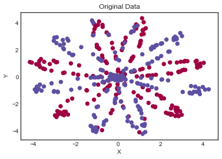
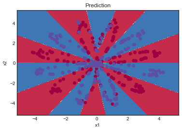

# ZYG Machine Learning Module

Using Coursera's [Neural Networks and Deep Learning](https://www.coursera.org/learn/neural-networks-deep-learning) course as motivation, I constructed the *basic* machine learning module found under **zyg.py**. It has many limitations. To name a few...

- It has only *sigmoid*, *tanh*, *ReLU* and *Leaky ReLU* <u>activations</u>.
- It has a hard-coded <u>cost function</u>.
- There is no capability for *momentum*, *bagging*, or the rest of the plethora of techniques to modify models.
- There is no *GPU acceleration*. 

This is just for fun. I know there are plenty of excellent python modules out there for machine learning. This project was simply me enjoying the process of putting one together myself.

### Load resources


```python
# Homebrew Machine Learning module
import zyg
```


```python
# Package imports
import numpy as np
import matplotlib.pyplot as plt

# Original planar_utils code thanks to Coursera
# This generates the flower-like system in which we use the model.
import planar_utils

# Output plots into notebook
# For some systems, this is necessary
%matplotlib inline

# Seed our random, so that results remain consistent
np.random.seed(1)
```

### Create and explore data

This is created using the planar_utils module from Coursera's Neural Networks and Deep Learning course.


```python
# Load basic flower system

# For development, reload modules when they have changed
# from importlib import reload
# planar_utils = reload(planar_utils)

# The system has 
#     Input: (double x, double y)
#     Output: Binary output {0: red, 1: blue}
x, y = planar_utils.load_planar_dataset(petals=12)
n_x = x.shape[0]
m = x.shape[1]

# Show original shape
print (x.shape)
print (y.shape)
print ('Number of inputs per data point: \t{}'.format(n_x))
print ('Number of data points: \t\t\t{}'.format(m))
```

    (2, 400)
    (1, 400)
    Number of inputs per data point: 	2
    Number of data points: 			400
    


```python
# Plot test data
plt.scatter(x[0, :], x[1, :], c=y[0, :], s=40, cmap=plt.cm.Spectral)
plt.title('Original Data')
plt.xlabel('X')
plt.ylabel('Y')
plt.show()
```





### Break up system data into train and test

Because there are so few data (400), it might be wiser to do a k-fold split, but to my understanding this is another shortcoming of my machine learning module. It restarts learning each time the fit method is called. For simplicity, we simply break up the data randomly.


```python
# Create array of indices for training and test data
ind_data = np.arange(m)
# Randomize the data points
np.random.shuffle(ind_data)

# Crop the test data to 30% of the total data
ind_stop = int(m * 0.3)
# Because the order was randomized, the data points will be random
# Keep the ratio at 30% test, 70% train
ind_test = ind_data[:ind_stop]
# Set the training data as the complement of the test data
ind_train = ind_data[ind_stop:]
```


```python
m_train = int(m * 0.75)
x_train = x[:, ind_train]
y_train = y[:, ind_train]
x_test  = x[:, ind_test]
y_test  = y[:, ind_test]
```

### Verify data processing

Because clean data is so important in machine learning, we verify that the data processing in the last few steps was successful. We do this by verifying the shapes and by using a built in NumPy function to check for overlap.


```python
print ('Train data')
print ('\tX is correct shape: {}, {}'.format(x_train.shape[0] == x.shape[0], x_train.shape))
print ('\tY is correct shape: {}, {}'.format(y_train.shape[0] == y.shape[0], y_train.shape))

print ('\nTest data')
print ('\tX is correct shape: {}, {}'.format(x_test.shape[0] == x.shape[0], x_test.shape))
print ('\tY is correct shape: {}, {}'.format(y_test.shape[0] == y.shape[0], y_test.shape))

print ('\nOverlap between train and test:')
print ('\tRepeated x[0, :]: {}'.format(np.intersect1d(x_train[0, :], x_test[0, :])))
print ('\tRepeated x[1, :]: {}'.format(np.intersect1d(x_train[1, :], x_test[1, :])))
```

    Train data
    	X is correct shape: True, (2, 280)
    	Y is correct shape: True, (1, 280)
    
    Test data
    	X is correct shape: True, (2, 120)
    	Y is correct shape: True, (1, 120)
    
    Overlap between train and test:
    	Repeated x[0, :]: []
    	Repeated x[1, :]: []
    

### Build, train model

There data was processed successfully! Let's build our model. We choose a two-layer model using tanh activation with 12 hidden units in the first layer. Because this is a binary classification, the final layer should have sigmoid activation. After I learn more about optimizing hidden units, I will update this example.


```python
# Build model structure
model = zyg.Model(x_train.shape[0])
model.layer(12, activation='tanh')
model.layer(1, activation='sigmoid')

# Fit the model!
# This is the fun part
model.fit(x_train, y_train, 
          verbose=True, compute_cost_every=1000, 
          learning_rate=0.7, iterations=5000, 
          random_init=True, random_scale=0.01
         )

# Test our results
y_hat = model.predict(x_test)
print ('Accuracy: %d' % float((np.dot(y_test, y_hat.T) + np.dot(1-y_test,1-y_hat.T))/float(y_test.size)*100) + '%')
```

    Cost after 0 iterations: 0.6930824395049114
    Cost after 1000 iterations: 0.3207917112757569
    Cost after 2000 iterations: 0.23605017808955805
    Cost after 3000 iterations: 0.20521530475858957
    Cost after 4000 iterations: 0.192419117505641
    Cost after 4999 iterations: 0.18451160759702978
    Accuracy: 87%
    

### Results

The model is 87% accurate! That is pretty good. Recall that this model was trained on only 30% of the data points where 87% is the accuracy on the remaining 70% of the data points. Below is a graphical decision boundary (original planar_utils code thanks to Coursera), that shows what our model thinks after training.


```python
planar_utils.plot_decision_boundary(lambda x: model.predict(x.T), x, y)
plt.title('Prediction')
```


    Text(0.5, 1.0, 'Prediction')




